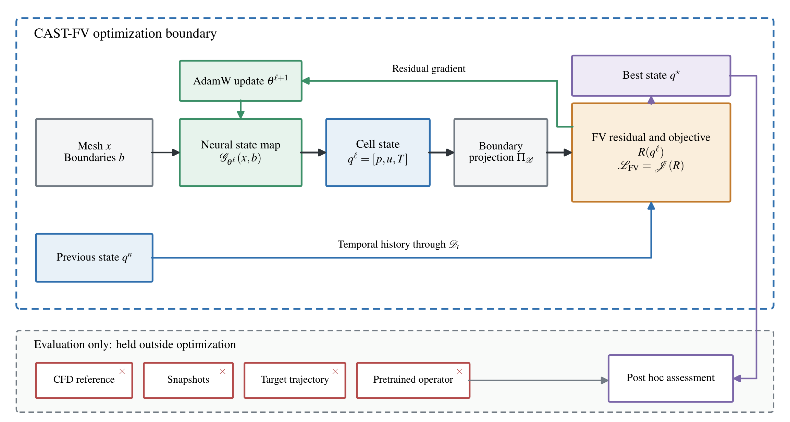
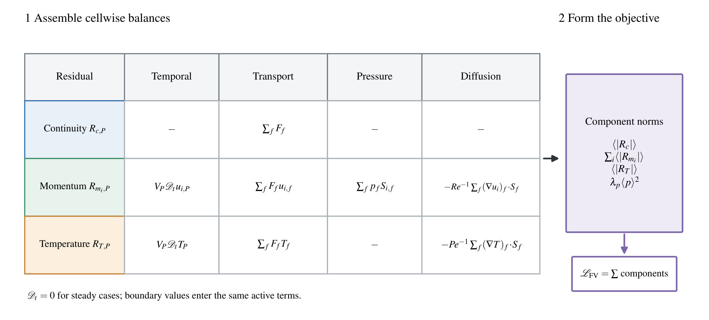
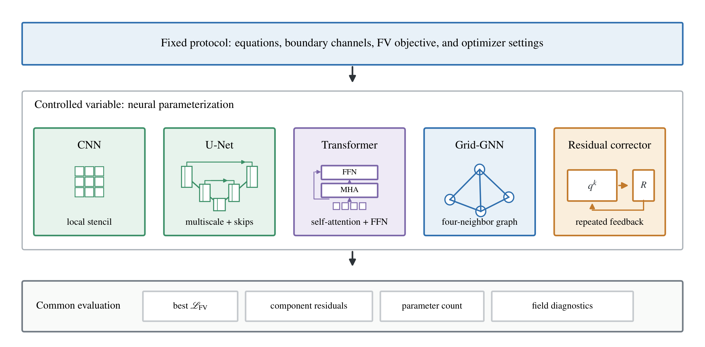

<div align="center">

# CAST-FV

### 有限体积约束下的紧凑神经状态优化

**无需解标签，直接构造流动与输运有限体积状态**

[](https://www.python.org/)
[](https://pytorch.org/)
[](#测试)

[English](README.md) · [算法说明](docs/ALGORITHM.md) · [发布清单](docs/RELEASE_CHECKLIST.md)

</div>

CAST-FV 使用紧凑神经映射表示完整的单元中心物理状态，并以统一的有限体积残差直接优化该状态。算法不依赖 CFD 解标签、目标轨迹或预训练算子权重。对于非稳态问题，每个指定物理时刻都重新建立神经映射和优化器；只有上一时刻保留的物理状态进入后向欧拉时间残差。

<p align="center">
  
</p>

## 核心特点

- **无需解标签的状态构造：** 方程、网格度量与边界条件共同定义优化目标。
- **统一的数值判据：** 所有候选架构均由同一套单元中心有限体积残差评价。
- **紧凑神经参数化：** 2D 提供 CNN、U-Net、Transformer、网格 GNN 和残差校正器，3D 提供紧凑 CNN。
- **受控物理时间推进：** 每个时刻独立优化，并保留固定更新预算内目标函数最低的有限状态。
- **仅公开算法：** 不包含 CFD 参考场、训练轨迹、模型检查点或当前方法范围之外的求解器扩展。

## 安装

```bash
git clone GITHUB_REPOSITORY_URL
cd CAST-FV
python -m venv .venv
source .venv/bin/activate
python -m pip install --upgrade pip
pip install -e ".[test]"
```

如需 GPU 运行，请先根据本机 CUDA 配置安装相应版本的 PyTorch，再执行本项目安装命令。

## 快速开始

运行一个小规模 CPU 稳态示例：

```bash
castfv steady \
  --dimension 2 \
  --cells 16 \
  --architecture cnn \
  --budget 25 \
  --device cpu \
  --output outputs/steady
```

运行两个物理时间层；每个时间层均建立新的神经映射：

```bash
castfv unsteady \
  --dimension 2 \
  --cells 16 \
  --architecture cnn \
  --budget 20 \
  --time-step 1.0 \
  --levels 2 \
  --device cpu \
  --output outputs/unsteady
```

在同一数值协议下比较五种 2D 状态参数化：

```bash
castfv compare \
  --cells 16 \
  --budget 20 \
  --device cpu \
  --output outputs/architecture_comparison
```

也可直接运行 [`examples/quick_start.py`](examples/quick_start.py) 与 [`examples/unsteady.py`](examples/unsteady.py)。

## 算法流程

每个稳态问题或物理时间层依次执行：

1. 由坐标和边界条件通道生成完整单元中心状态；
2. 通过代数关系构造边界面值；
3. 组装连续性、动量与被动标量有限体积残差；
4. 在固定更新预算下，用 AdamW 最小化各方程残差绝对值的均值；
5. 保留优化过程中目标函数最低的有限候选状态。

非稳态推进时，上一时间层的保留状态是下一时间层唯一的时间历史；网络权重与优化器状态不会跨物理时间层传递。

<p align="center">
  
</p>

公式、状态定义及代码对应关系见 [`docs/ALGORITHM.md`](docs/ALGORITHM.md)。

## 架构范围

<p align="center">
  
</p>

| 功能 | 2D | 3D |
|---|:---:|:---:|
| 紧凑 CNN | ✓ | ✓ |
| U-Net | ✓ | — |
| Transformer | ✓ | — |
| 网格 GNN | ✓ | — |
| 残差校正器 | ✓ | — |
| 稳态构造 | ✓ | ✓ |
| 后向欧拉推进 | ✓ | ✓ |

## 公开边界

本仓库是相关 *Physics of Fluids* 论文中 CAST-FV 算法的最小公开实现，包含笛卡尔网格上的 2D/3D 不可压缩流动与被动标量有限体积残差、稳态构造、后向欧拉物理时间推进、五种 2D 参数化、示例和测试。

为保持公开范围与本文方法一致，本仓库不包含：

- CFD 参考解、快照、目标轨迹及论文结果数据；
- 预训练模型、学习型算子、FNO/PINO 实现及时间对比数据；
- 压力投影、持续面通量、接受状态等当前方法范围之外的算法；
- 私有路径、实验日志及未公开检查点。

论文中的受控实验采用 $48\times48$ 网格。快速开始命令使用较小网格，仅用于验证安装和流程；完整规模运行可指定 `--cells 48` 并使用论文相应的更新预算。

## 测试

```bash
pytest -q
```

测试覆盖输入特征、2D/3D 零状态残差、全部公开架构的输出形状、稳态优化和多层物理时间推进。

## 代码可用性

仓库公开后，论文可直接采用：

> The source code implementing CAST-FV is publicly available on GitHub at **GITHUB_REPOSITORY_URL**.

投稿前须将占位符替换为真实公开网址，详见 [`docs/CODE_AVAILABILITY.md`](docs/CODE_AVAILABILITY.md)。

## 许可证

目前尚未选择软件许可证。公开仓库前应添加 `LICENSE` 文件；若作者希望允许宽松复用，建议选择 MIT License。在许可证加入前，默认不授予代码复用许可。

## 联系方式

- 代码：Demin Liu — liudemin@stu.xjtu.edu.cn
- 通讯作者：Tieyu Gao — sunmoon@mail.xjtu.edu.cn
